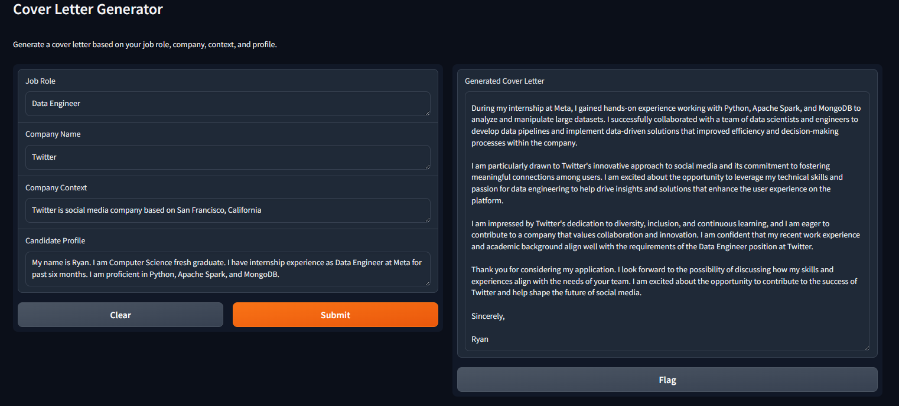

# Cover Letter Generator

Tired of making personalized cover letter for specific company everytime you applying job? Also tired of applying hundred of jobs with different cover letters just to be rejected later? Well, let's just make it more efficient and less time consuming while keeping cover letter quality as good as possible with LLM powered app.

Cover Letter Generator is an AI-powered application that crafts personalized cover letters on the fly. Built with LangChain and Gradio library, it harnesses the power of ChatGPT to generate contextually relevant and engaging cover letters. Simply input your job role, target company's name & brief details, and your profile details (work experience, academic background, etc.) and let the magic happen!



## Getting Started

These instructions will help you set up the project locally on your machine.

### Prerequisites

To run this application, you will need to have:

- A Python environment running Python 3.6 or newer.
- An OpenAI API Key (stored in local environment).
- Required libraries (LangChain, Gradio, etc.).

### Installation

1. Clone this repository with the command:

    ```bash
    git clone https://github.com/0xrsydn/cover-letter-gen.git
    ```

2. Install the required libraries with the command:

    ```bash
    pip install -r requirements.txt
    ```
    You can use python package manager such as venv or conda (it's your choice). In here, i use CPU to run the program, if you want to use GPU, install faiss-gpu instead.
   
3. Run the application with the command:

    ```bash
    python app.py
    ```

Your application should now be running on local URL, `http://127.0.0.1:7860`.

## Update

- Candidate profile input changed to user CV PDF file (RAG feature).
- Changed to GROQ API Key (faster and free).

## ToDo

- [ ] Adding job post url for more accurate and specific cover letter.
- [ ] Browsing tool for company context instead of manual input.

## Usage

Fill in the required fields:

1. Input your target job role, e.g., `Software Engineer`.
2. Input the company's name, e.g., `Google Inc.`
3. Provide a brief detail about the target company, e.g., `A multinational tech company specializing in internet-related products and services.`
4. ~~Describe your profile (work experiences, academic background, etc.), e.g., `Graduated with a Computer Science degree and have 4 years of experience as a backend engineer.`~~ Changed to using PDF file RAG which is should be our resume (ATS) as candidate profile for better cover letter generation and effective generative (less writing!)

## Live Demo

You can check my live demo hosted on Hugging Face Space. There is two version currently which is based on text input only, [First Version](https://huggingface.co/spaces/0xrsydn/cover-letter-gen) and [Second Version](https://huggingface.co/spaces/0xrsydn/cover-letter-gen-v2) (RAG feature).

## Contributing

Pull requests are welcome. For major changes, please open an issue first to discuss what you would like to change.

### Note

As with all AI outputs, generated cover letters should be reviewed and thoroughly checked before use. The developer holds no liability for any inaccuracies or issues arising from the use of generated content.

Suggestions are always welcome.
